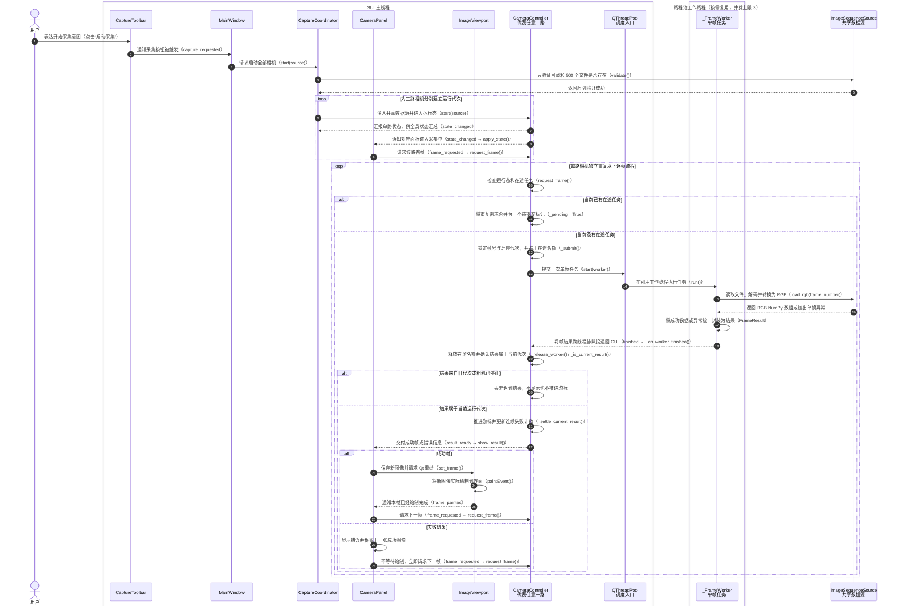
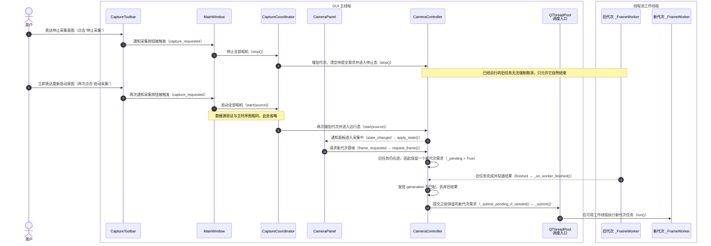
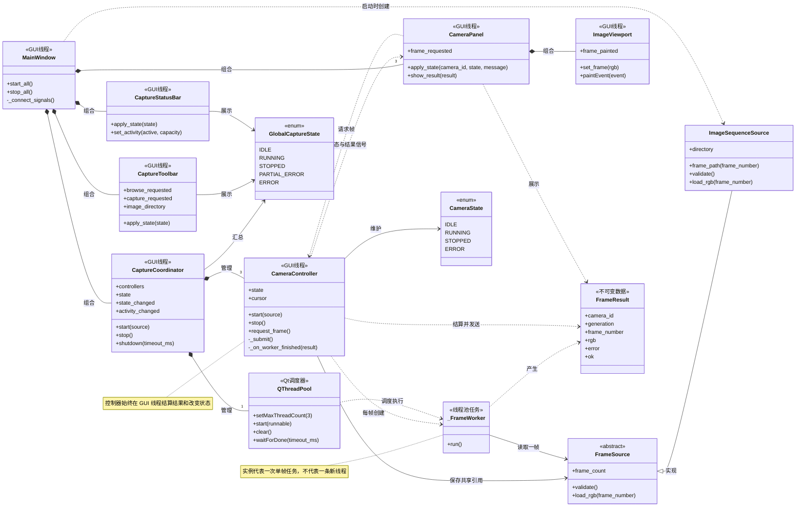

# CameraViewer：View 驱动的 Pull 模型

> **核心结论：** 首帧由 `CameraPanel` 进入 `RUNNING` 时请求；后续成功帧只有在
> `ImageViewport.paintEvent()` 真正完成绘制后才会请求。采集循环不依赖固定定时器。

## 线程模型：实际有多少条线程？

时序图中的参与者表示职责，不代表每个参与者各占一条线程。项目显式定义的业务执行上下文如下：

| 执行上下文 | 数量 | 负责内容 |
| --- | --- | --- |
| GUI 主线程 | 固定 1 条 | 窗口、面板、状态汇总、单路调度和所有界面更新 |
| `QThreadPool` 工作线程 | 同时最多 3 条 | 文件读取、JPEG 解码和 BGR→RGB 转换 |
| `_FrameWorker` | 任务对象，不是线程 | 描述一次“读取并处理一帧”的工作，由线程池调度 |

`CaptureCoordinator` 将线程池上限设置为三，是因为三路相机各自最多只有一个在途任务。
因此高峰时最多并行执行三个单帧任务，加上 GUI 主线程，业务代码最多同时在四条线程上执行。

线程池按需创建并复用工作线程。任务结束后，线程可能在池中空闲一段时间再退出，所以操作系统中
看到的线程数不一定等于当前在途任务数。这里描述的是项目主动建立的线程模型，不包含 Qt、图形
驱动或 OpenCV 可能使用的内部辅助线程。

## 主时序图：启动与逐帧采集

图中每条消息先说明动作含义，括号内才是对应函数或信号。

这张图中的 `QThreadPool` 是调度入口，`_FrameWorker` 是被调度的任务。只有
`_FrameWorker.run()` 及其调用的 `load_rgb()` 在线程池工作线程执行；结果结算、状态信号、
面板更新和绘制都回到 GUI 主线程。

## 停止后立即重启：为什么旧结果不会串入新会话？

## 关键类图（UML）

类之间有两条主要链路：

- **控制链路：** `MainWindow → CaptureCoordinator → CameraController`，负责验证、启停、
  代次隔离和状态汇总。
- **帧链路：** `CameraPanel → CameraController → _FrameWorker → FrameSource`，结果再由
  `CameraController → CameraPanel → ImageViewport` 返回界面。

## Pull 模型的关键约束

| 约束 | 含义 | 对应代码 |
| --- | --- | --- |
| View 决定何时继续 | Controller 不主动循环；首帧和下一帧需求都来自 View | `CameraPanel.apply_state()`、`ImageViewport.paintEvent()` |
| 每路最多一个在途任务 | 重复请求只设置一个 `_pending` 标记，不形成帧队列 | `CameraController.request_frame()`、`_submit()` |
| 绘制完成才继续 | `set_frame()` 只请求重绘，真正的下一次 Pull 来自 `paintEvent()` | `ImageViewport.set_frame()`、`paintEvent()` |
| 失败也推进游标 | 单帧损坏不会卡死在同一文件，失败结果交付后立即继续 | `CameraController._settle_current_result()`、`CameraPanel.show_result()` |
| 旧代次结果必须丢弃 | 停止或重启前创建的任务不能改变新会话状态 | `CameraController._is_current_result()` |

这些约束形成天然背压：读取、解码或绘制变慢时，下一次需求也会相应推迟，不会无限预取或积压帧。

## 主要异常与边界场景

| 场景 | 处理方式 |
| --- | --- |
| 目录不存在或 500 帧序列不完整 | 协调器捕获验证异常并将三路 Controller 设为 `ERROR`，不发起首帧 Pull |
| 已有在途 Worker 时再次收到请求 | 不创建第二个任务，只设置 `_pending=True`；多个重复请求合并为一个 |
| 单帧读取、解码或处理失败 | 推进 cursor、显示错误、保留上一张成功图像并立即 Pull 下一帧 |
| 连续 500 帧失败 | 仅对应 Controller 进入 `ERROR`，其他两路继续运行 |
| 采集中点击停止 | 增加 generation、清除 pending 并进入 `STOPPED`；最后一张成功图像保留 |
| Worker 在停止后迟到返回 | generation 不匹配，结果不显示且 cursor 不推进 |
| 停止后立即重启，旧 Worker 尚未结束 | 新需求保存为 pending；旧结果被丢弃后提交新代次任务 |
| 普通窗口重绘 | 不触发 Pull；只有 `set_frame()` 标记的新帧会在绘制后发出 `frame_painted` |

## 核心代码入口

| 职责 | 类与方法 | 文件 |
| --- | --- | --- |
| 全局启动/停止 | `MainWindow.start_all()` / `stop_all()` | [`main_window.py`](../cameraviewer/main_window.py) |
| 数据源验证与三路协调 | `CaptureCoordinator.start()` / `stop()` | [`capture.py`](../cameraviewer/capture.py) |
| 首帧请求 | `CameraPanel.apply_state()` | [`widgets.py`](../cameraviewer/widgets.py) |
| 绘制完成后的下一帧请求 | `ImageViewport.paintEvent()` | [`widgets.py`](../cameraviewer/widgets.py) |
| 单路 Pull 调度 | `CameraController.request_frame()` / `_submit()` | [`capture.py`](../cameraviewer/capture.py) |
| 结果结算与迟到过滤 | `CameraController._on_worker_finished()` | [`capture.py`](../cameraviewer/capture.py) |
| 后台单帧任务 | `_FrameWorker.run()` | [`capture.py`](../cameraviewer/capture.py) |

> **判断实现是否正确：** 首帧由 View 发起；成功帧只有实际绘制后才继续；失败结果交付后
> 立即继续；旧 generation 的结果永远不能进入 View。
